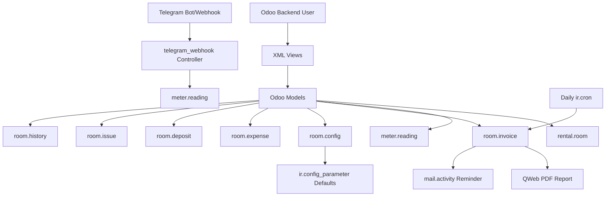

# System Design & Architecture

## Architecture Overview

Module được thiết kế như một ứng dụng Odoo monolith, trong đó toàn bộ nghiệp vụ nằm trong custom models, views, report QWeb, scheduled action và một HTTP controller cho Telegram.

Các thành phần chính:

- `rental.room`: aggregate root cho phần lớn dữ liệu nghiệp vụ.
- `meter.reading`: quản lý chỉ số điện/nước, logic thay công tơ, nhập qua Telegram.
- `room.invoice`: tính tiền, vòng đời hóa đơn, liên kết với chỉ số công tơ.
- `room.config`: giá tiện ích theo ngày hiệu lực.
- `room.expense`, `room.deposit`, `room.issue`, `room.history`: nghiệp vụ bổ trợ.
- `telegram_webhook.py`: điểm vào cho bot Telegram.
- `invoice_template.xml`: in hóa đơn PDF.
- `cron_data.xml`: cập nhật quá hạn và nhắc thanh toán theo lịch.

## Data Models

### Core entities

- `rental.room`
  - Thông tin phòng, chủ phòng, giá thuê mặc định, mã Telegram.
  - Quan hệ `One2many` tới hóa đơn, chỉ số, chi phí, cấu hình giá, cọc, sự cố.
  - Tính tổng `total_invoiced`, `total_paid`, `total_remaining`, `total_expenses`.

- `room.config`
  - Thuộc một phòng.
  - Xác định giá điện, nước, wifi, rác, gửi xe, tiện ích khác theo `effective_date`.
  - Có unique `(room_id, effective_date)`.

- `meter.reading`
  - Thuộc một phòng, có `reading_date` và `reading_month`.
  - Lưu số cũ, số mới, mức tiêu thụ điện/nước.
  - Hỗ trợ thay công tơ và manual override cho usage.
  - Liên kết tối đa một `room.invoice`.

- `room.invoice`
  - Thuộc một phòng, có `invoice_number`, `invoice_month`, `invoice_date`, `due_date`.
  - Liên kết optional tới `meter.reading` và `applied_config_id`.
  - Tính các thành phần tiền và `remaining_amount`.

- `room.expense`
  - Chi phí phát sinh theo phòng và danh mục.

- `room.deposit`
  - Quản lý tiền cọc, số tiền hoàn và trạng thái hoàn.

- `room.issue`
  - Quản lý sự cố theo phòng, mức độ và trạng thái xử lý.

- `room.history`
  - Lưu thông tin lịch sử phòng đã ở và tổng chi phí tham chiếu từ `room_id`.

### Relationship summary

- `rental.room 1-n room.invoice`
- `rental.room 1-n meter.reading`
- `rental.room 1-n room.config`
- `meter.reading 0-1 room.invoice`
- `room.invoice n-1 room.config` tại thời điểm áp giá

## API Design

### Internal interfaces

- `rental.room._get_active_config(reference_date)`
  - Trả về cấu hình giá gần nhất còn hiệu lực cho một phòng.
- `meter.reading.action_create_invoice()`
  - Tạo hóa đơn từ chỉ số.
- `room.invoice._apply_config_prices(force=False)`
  - Áp giá từ `room.config` hoặc fallback từ `ir.config_parameter`.
- `room.invoice.cron_update_overdue_status()`
  - Cron cập nhật trạng thái và tạo reminder activity.

### External interface

- HTTP route: `/room_rental_expense/telegram/webhook`
  - Method: `POST`
  - Auth: `public`
  - Secret validation: `X-Telegram-Bot-Api-Secret-Token` hoặc query/body `secret`
  - Xử lý message Telegram, trả JSON và gửi phản hồi lại chat qua Telegram Bot API.

### Telegram commands

- `P101 350 28`
- `room:P101 elec:350 water:28`
- `INV P101 2026-04-14`
- `SHOW INV-2026-001`
- `PAID INV-2026-001`
- `PAY INV-2026-001 1000000`
- `UNPAID INV-2026-001`
- `/help`

## Component Breakdown

### Backend models

- Python model files dưới `project/room_rental_expense/models/`.
- Tập trung logic tính toán, ràng buộc và thao tác trạng thái.

### UI layer

- XML views cho list/form/search/report/menu.
- Widget JS `vnd_currency` và `number_format` để format số theo chuẩn hiển thị Việt Nam.

### Reporting

- QWeb PDF cho hóa đơn phòng.

### Automation

- `ir.sequence` tạo số hóa đơn dạng `INV-%(year)s-####`.
- `ir.cron` chạy hằng ngày cho overdue/reminder.

### External integration

- Telegram webhook + Telegram Bot API response.

## Design Decisions

- Dùng model custom thay vì kế thừa `account.move` để giữ giải pháp gọn cho use case cá nhân.
- Khóa sửa dữ liệu sau khi chỉ số đã gắn hóa đơn hoặc hóa đơn rời trạng thái nháp để bảo toàn tính nhất quán.
- Tách `room.config` khỏi `rental.room` để hỗ trợ lịch sử thay đổi giá theo thời gian.
- Cho phép manual override mức tiêu thụ để xử lý dữ liệu thực tế không khớp công thức chuẩn.
- Dùng `mail.thread` và `mail.activity.mixin` cho `rental.room` và `room.invoice` để có chatter và nhắc việc mà không cần xây thêm hệ thống notification riêng.

## Non-Functional Requirements

### Performance

- Khối lượng dữ liệu dự kiến nhỏ đến trung bình.
- Các compute hiện tại chủ yếu dựa trên quan hệ trực tiếp; chấp nhận được cho use case cá nhân.

### Security

- ACL mở cho toàn bộ `base.group_user`.
- Telegram webhook có cơ chế secret token và allowlist `chat_id` dạng cấu hình.
- Cần tránh log ra bot token hoặc dữ liệu nhạy cảm.

### Reliability

- Nếu không tìm thấy `room.config`, hệ thống vẫn hoạt động nhờ giá mặc định trong `ir.config_parameter`.
- Nếu gửi phản hồi Telegram thất bại, webhook vẫn hoàn tất xử lý nghiệp vụ phía Odoo.
