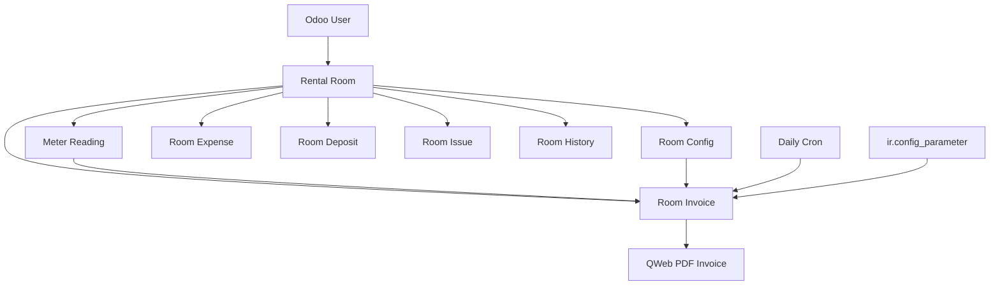

# System Design & Architecture

## Architecture Overview
**What is the high-level system structure?**

- The module is an Odoo 19 application centered on `rental.room`
- Operational records hang off the room as one-to-many children
- `room.invoice` is the main business object where pricing, usage, payment state, reminders, and reporting converge

## Data Models
**What data do we need to manage?**

### Core Entities
- `rental.room`: room identity, address, landlord info, default rent, chatter, and roll-up totals
- `room.config`: dated utility and recurring fee configuration per room
- `meter.reading`: monthly counters, usage calculation, replacement handling, optional invoice link
- `room.invoice`: invoice header, usage, pricing, totals, payment amounts, config snapshot, reminder logic
- `room.expense`: incidental room expenses
- `room.deposit`: deposit placement and return status
- `room.issue`: room problem tracking
- `room.history`: historical summary linked to a room

### Important Relationships
- `rental.room` 1:n `room.invoice`
- `rental.room` 1:n `meter.reading`
- `room.invoice` n:1 `meter.reading` as an optional selected reading
- `room.invoice` n:1 `room.config` as the applied pricing snapshot

## API Design
**How do components communicate?**

- Interaction is model-driven through standard Odoo ORM methods, onchange handlers, computed fields, constraints, and actions
- No external API layer exists
- Main internal interfaces:
  - `rental.room._get_active_config(reference_date)`
  - `room.invoice._apply_config_prices(force=False)`
  - `room.invoice._sync_meter_readings()`
  - `meter.reading._get_previous_reading(room, reading_date, exclude_id=None)`
  - `room.invoice.cron_update_overdue_status()`

## Component Breakdown
**What are the major building blocks?**

### Backend Models
- `models/rental_room.py`: hub model plus totals and room actions
- `models/meter_reading.py`: utility reading logic and integrity rules
- `models/room_invoice.py`: invoice lifecycle, pricing, reminders, report action
- Remaining models: supporting financial and historical records

### UI / Views
- Menu tree under `Quản Lý Phòng Trọ`
- Room form acts as the primary navigation surface with embedded tabs
- Dedicated list/form/search/report views for invoices, readings, expenses, deposits, issues, config, and history

### Data / Automation
- Sequence for invoice numbering
- Config parameters for default utility prices and reminder lead time
- Daily cron to update overdue invoices and schedule reminder activities

### Reporting / Frontend
- QWeb PDF invoice report
- Backend JS currency widget added in the cleanup commit for formatted display

## Design Decisions
**Why did we choose this approach?**

- **Room-centric design**: keeps all related operational records discoverable from one master form
- **Applied config snapshot**: prevents historical invoices from drifting when prices change later
- **Invoice-centric payment state**: simpler than introducing a separate payment ledger for a personal-use module
- **Constraint-first integrity**: invalid room/meter/invoice combinations are blocked in model logic, not left to UI discipline
- **Fallback defaults**: allows invoice creation before room-specific configuration is complete

## Non-Functional Requirements
**How should the system perform?**

- **Usability**: create room child records directly from tabs with `default_room_id` context
- **Reliability**: linked meter readings cannot be deleted and cross-room linkage is rejected
- **Auditability**: invoice keeps sequence number, applied config, payment state, and printable snapshot
- **Security**: current design is intentionally simple; all business models are open to `base.group_user`
